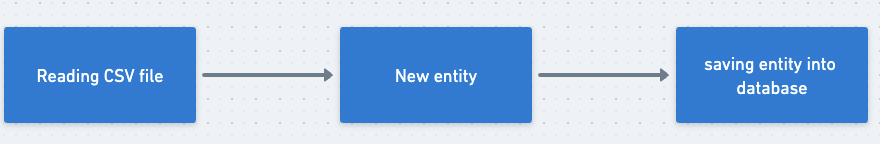
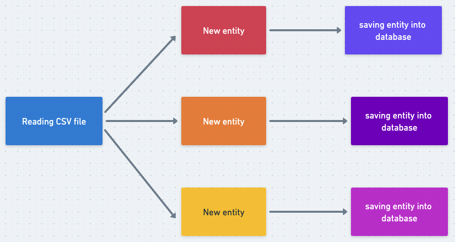
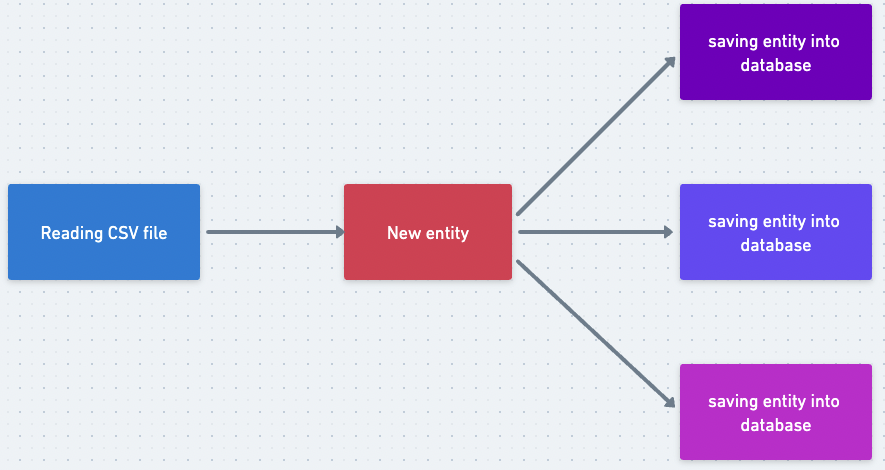

<h1 align="center">CSV Movies</h1>


## 📃 About

This is a basic project to practice GO concurrency/paralellism. The challenge was to read from a CSV file
several movies and storing each one of them in a database. I developed 3 strategies of doing it, that each one of them has two 
possible ways of reading the file, totalizing 6 possible manners of doing it, 4 of them using concurrency. 
This code is a challenge of the https://app.devgym.com.br/ platform.

## 🗄 Libs/Dependencies

| Name        | Description | Documentation | Installation |
| ----------- | ----------- | ------------- | ----------- |     
| pgx      | postgres database driver       |  github.com/jackc/pgx/v4 |  go get go get github.com/jackc/pgx/v4      |

## ⚙️ Setup

Clone the github repository:

```bash
git clone https://github.com/MCarbono/go-csv-processor.git
``` 

Go to project's folder

```bash
cd go-csv-processor
```

Start the database with one of the commands below: 

```bash
docker compose up -d
```

```bash
make db_up
```

To exclude the database container, use one of the commands below: 

```bash
docker compose down
```

```bash
make db_down
```

## ⚙️ Run

Below I explain about the 3 strategies that I developed to complete this challenge. 

### Iterative

This strategy don't use any concurrent code. Basically its a iteration over each line of the file,
instantiating a new entity and saving it into database. 



Use one of the commands below to run one usecase:  

```bash
make iterative
```

```bash
make iterative-readall
```

<p id="pipeline-worker"></p>

### Pipeline Worker

This strategy utilizes the benefits of reading the CSV file using Go's concurrency. 
Before the csv lines is read, its created a pipeline connected by that reads the lines of the csv from a channel.
The pipeline consists on goroutines. Each square represents one goroutine that performs one action, 
doing one step of the process. 



Use one of the commands below to run one usecase:  

```bash
make pipeline-worker-readall
```

```bash
make pipeline-worker
```

### Fan-out Worker

This strategy utilizes the benefits of reading the CSV file using Go's concurrency. 
This is a similar strategy of the <a href="#pipeline-worker">Pipeline Worker</a> but in this process
we only have one goroutine reading the lines of the csv file from a channel, instantiating the entity and
passing it to another buffered channel that is read from N goroutines that has only one job, save the entity
to the database.



Use one of the commands below to run one usecase:  

```bash
make fanout-worker
```

```bash
make fanout-worker-readall
```

## 🧪 Benchmark

In the root project folder, run one of the commands below:

```bash
make bench
```

```bash
go test -bench=. -benchmem
```
